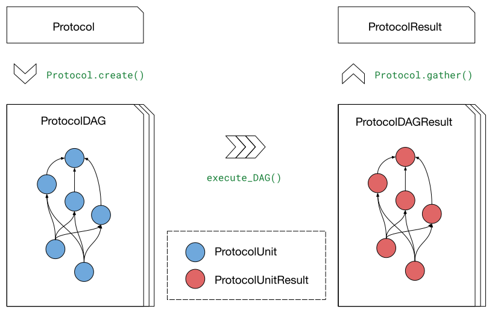

Data models included in **gufe**
================================

The core of the **gufe** data model is the :class:`.GufeTokenizable` class,
but **gufe** features more than just this base data structure.

To ensure interoperability,
**gufe** also defines classes of objects that represent the core chemistry and alchemistry of a free energy pipeline,
including molecules, chemical systems, and alchemical transformations.
In other words, **gufe** provides a shared language used by tools across the OpenFE ecosystem.

Below, you will learn how the various pieces of **gufe** fit together.
Generally speaking, :ref:`ChemicalSystems <chemicalsystem>` can be thought of as the *what* or the *nouns* that we are simulating,
:ref:`Transformations <transformation>` are the *how* or the *verbs* that encode how we are simulating these objects and moving between them,
and an :ref:`alchemicalnetwork` is like a sentence that groups all of these together.

.. image:: ../_static/alchemical_network_diagram.svg
    :alt: The ``GufeTokenizable`` representation of an ``AlchemicalNetwork``.

.. note::

    Some of these classes are designed to be subclassed, and constitute the *extensible points* of the library.
    These include the following; see the **How-To Guide** for more information on how to extend from each:

    1. :ref:`Component <component>` : :ref:`howto-component`
    2. :ref:`Protocol <protocol>` : :ref:`howto-protocol`
    3. :ref:`ComponentMapping <componentmapping>` : :ref:`howto-componentmapping`
    4. :ref:`AtomMapping <atommapping>` : :ref:`howto-atommapping`
    5. :ref:`AtomMapper <atommapper>` : :ref:`howto-atommapper`

.. _component:

``Component``
-------------

The :class:`.Component` class represents a portion of a system of molecules,
with a single ``Component`` capable of representing anything from an individual drug-like molecule, an entire protein, or (even the concept of) a solvent with ions.

``Components`` are often used as the building blocks of a :ref:`chemicalsystem`, which form the nodes of an :ref:`alchemicalnetwork`.
The same ``Component`` may be present within multiple ``ChemicalSystem``\s, such as a :class:`.ProteinComponent` in an ``AlchemicalNetwork`` featuring relative binding transformations between ligands.

As another distinct example: the :class:`.SmallMoleculeComponent` class (which is a subclass of :class:`.Component`) is used to form the nodes of a :ref:`ligandnetwork`.
This is useful for representing relative transformations between a series of small molecules without invoking the additional complexity of an :ref:`alchemicalnetwork`.

.. note::
    The :class:`.Component` is an *extensible point* of the library,
    and is intended to be subclassed to enable new applications.
    For details on how to create your own :class:`.Component` classes, see :ref:`howto-component`.

.. _chemicalsystem:

``ChemicalSystem``
------------------

A :class:`.ChemicalSystem` represents a complete system of molecules and is often composed of multiple :ref:`Components <component>`.

These are most often used as nodes of an :ref:`alchemicalnetwork`, with pairs of :ref:`ChemicalSystems <chemicalsystem>` connected by :ref:`Transformations <transformation>`.
Because a ``ChemicalSystem`` functions as a kind of container of :ref:`Components <component>`, more than one ``ChemicalSystem`` can feature the same ``Component``.
This allows even very large ``AlchemicalNetwork``\s to be relatively small in memory, as only a few large ``Component``\s like :class:`.ProteinComponent`\s may be shared among hundreds of ``ChemicalSystem``\s.
See :ref:`gufe-memory-deduplication` for more details about this memory optimization.

When used as inputs to a ``Transformation``, ``ChemicalSystem``\s represent the set of ``Component``\s for which a free energy difference will be estimated.
Alchemical methods performing free energy perturbation (FEP) between the two ``ChemicalSystem``\s of a ``Transformation`` will simulate these ``Component``\s using some sampling approach, obtaining enough information to derive a free energy difference estimate.

.. _transformation:

``Transformation``
------------------

A :class:`.Transformation` represents an alchemical transformation between two :ref:`ChemicalSystems <chemicalsystem>`.

``Transformation`` objects are often used as the edges of an :ref:`alchemicalnetwork`.
In addition to referencing the two ``ChemicalSystem``\s it spans,
a ``Transformation`` also includes the :ref:`protocol` used to actually perform the alchemical transformation,
as well as an :ref:`componentmapping` specifying what portions of the :ref:`Components <component>` are being transformed across the ``ChemicalSystem``\s.

A ``Transformation`` functions as a container for all the information needed to obtain an estimate of the free energy difference between its two ``ChemicalSystem``\s.

.. _nontransformation:

``NonTransformation``
---------------------

A :class:`.NonTransformation` represents non-alchemical sampling of a single :ref:`ChemicalSystem <chemicalsystem>`.

In the context of an :ref:`alchemicalnetwork`, a ``NonTransformation`` is effectively a self-loop, featuring the same ``ChemicalSystem`` at either end.
Similar to a :ref:`Transformation <transformation>`, it features a :ref:`protocol` used to perform sampling on its ``ChemicalSystem``, but does not feature a :ref:`componentmapping` since there is no second ``ChemicalSystem``.
An example of a ``Protocol`` that would be appropriate for a ``NonTransformation`` is one that performs equilibrium molecular dynamics of the ``ChemicalSystem``.

A ``NonTransformation`` cannot be used to obtain a free energy difference estimate, since by definition transforming the ``ChemicalSystem`` to itself should give exactly ``0``.

.. _protocol:

``Protocol``
------------

A :class:`.Protocol` represents the specific sampling approach used to transform one :ref:`ChemicalSystem <chemicalsystem>` into another (as in a :ref:`Transformation <transformation>`), or to simply sample a single :ref:`ChemicalSystem <chemicalsystem>` (as in a :ref:`NonTransformation <nontransformation>`).

``Protocol`` objects are often used as part of a ``Transformation``, although they can be used on their own alongside ``ChemicalSystem``\s and ``ComponentMapping``\s (when needed) to obtain free energy difference estimates.
Individual ``Protocol`` subclasses obtain these estimates in a wide variety of ways, with varying domains of applicability and effectiveness.

The :meth:`.Protocol.create` method is used to generate :ref:`ProtocolDAGs <protocoldag>` that can be executed to produce :ref:`ProtocolDAGResults <protocoldagresult>`.
The :meth:`.Protocol.gather` method is then used to aggregate the contents of many :ref:`ProtocolDAGResults <protocoldagresult>` into a :ref:`ProtocolResult <protocolresult>`.

.. note::
    The :class:`.Protocol` is an *extensible point* of the library,
    and is intended to be subclassed to enable new applications.
    For details on how to create your own :class:`.Protocol` classes, see :ref:`howto-protocol`.

.. _protocoldag:

``ProtocolDAG``
^^^^^^^^^^^^^^^

A :class:`.ProtocolDAG` is an executable object that performs a :ref:`Protocol <protocol>`.

A ``ProtocolDAG`` is created via :meth:`.Protocol.create` in combination with :ref:`ChemicalSystem(s) <chemicalsystem>` and a :ref:`ComponentMapping <componentmapping>` (when needed).
It is a `directed acyclic graph <https://en.wikipedia.org/wiki/Directed_acyclic_graph>`_ (DAG) of :ref:`ProtocolUnits <protocolunit>` and their dependency relationships.
The ``ProtocolUnit``\s of this ``ProtocolDAG`` can be executed in dependency-order to yield information needed for a free energy difference estimate.

``ProtocolDAG``\s are generally only handled directly by ecosystem tools that perform :ref:`Transformation <transformation>` execution.

.. _protocolunit:

``ProtocolUnit``
^^^^^^^^^^^^^^^^

A :class:`.ProtocolUnit` is the unit of execution of a :ref:`ProtocolDAG <protocoldag>`, functioning as a node with dependency relationships within the `directed acyclic graph <https://en.wikipedia.org/wiki/Directed_acyclic_graph>`_ (DAG).

A ``ProtocolUnit`` retains all of its inputs as attributes, including any ``ProtocolUnit``\s present among those inputs.
An execution engine performing the ``ProtocolUnit`` feeds the :ref:`ProtocolUnitResults <protocolunitresult>` corresponding to its dependencies to its
:meth:`.ProtocolUnit.execute` method, returning its own :ref:`ProtocolUnitResult <protocolunitresult>` upon success.
If the ``ProtocolUnit`` fails to execute, a :ref:`ProtocolUnitFailure <protocolunitfailure>` is returned instead.

Because ``ProtocolUnit``\s are only a function of their inputs and dependencies, they can be executed and retried by an execution engine in a variety of ways, in different processes, on different machines, etc.
Their outputs can also be preserved to allow for partial execution and a form of checkpointing for :ref:`ProtocolDAGs <protocoldag>`.

.. note::
    The :class:`.ProtocolUnit` is an *extensible point* of the library alongside :class:`.Protocol`,
    and is intended to be subclassed to enable new applications.
    For details on how to create your own :class:`.ProtocolUnit` classes, see :ref:`howto-protocol`.

.. _protocolunitresult:

``ProtocolUnitResult``
^^^^^^^^^^^^^^^^^^^^^^

A :class:`.ProtocolUnitResult` retains the results from successful execution of a :ref:`ProtocolUnit <protocolunit>`.

A ``ProtocolUnitResult`` retains as attributes all of its inputs, including any ``ProtocolUnitResult``\s present among those inputs.
It is returned by a successful call to its corresponding :meth:`.ProtocolUnit.execute` method, and retains all outputs from execution.
It also retains its start and end ``datetime``, and potentially other provenance information.

.. _protocolunitfailure:

``ProtocolUnitFailure``
^^^^^^^^^^^^^^^^^^^^^^^

A :class:`.ProtocolUnitFailure` retains the results from failed execution of a :ref:`ProtocolUnit <protocolunit>`.

A ``ProtocolUnitFailure`` retains the same information as a ``ProtocolUnitResult``,
but because it is returned by a failed call to its corresponding :meth:`.ProtocolUnit.execute` method, it has not outputs to retain.
It does, however, retain the :class:`Exception` and traceback of the error.

.. _protocoldagresult:

``ProtocolDAGResult``
^^^^^^^^^^^^^^^^^^^^^

A :class:`.ProtocolDAGResult` retains the results from executing a :ref:`ProtocolDAG <protocoldag>`.

A ``ProtocolDAGResult`` contains the same information as a ``ProtocolDAG`` (including ``ProtocolUnit``\s and their dependency relationships), while also featuring the set of :ref:`ProtocolUnitResults <protocolunitresult>` (and :ref:`ProtocolUnitFailures <protocolunitfailure>`, if present) that resulted from each.
Each individual ``ProtocolDAGResult`` always contains enough information to obtain a free energy difference estimate, though perhaps undersampled and unconverged.

Multiple ``ProtocolDAGResult``\s can be aggregated together via :meth:`.Protocol.gather` to yield a :ref:`ProtocolResult <protocolresult>`, giving the best estimate for the free energy difference possible given the data presented among the ``ProtocolDAGResult``\s.

.. _protocolresult:

``ProtocolResult``
^^^^^^^^^^^^^^^^^^

A :class:`.ProtocolResult` aggregates the results from one or more :ref:`ProtocolDAGResults <protocoldagresult>` to yield a free energy difference estimate.

``ProtocolResult`` objects are created from :meth:`.Protocol.gather`, and feature the ``Protocol``-specific methods necessary to obtain actual free energy difference estimates from a set of ``ProtocolDAGResult``\s, namely:

* :meth:`.ProtocolResult.get_estimate`
* :meth:`.ProtocolResult.get_uncertainty`

.. note::
    The :class:`.ProtocolResult` is an *extensible point* of the library alongside :class:`Protocol`,
    and is intended to be subclassed to enable new applications.
    For details on how to create your own :class:`.ProtocolResult` classes, see :ref:`howto-protocol`.

.. _componentmapping:

``ComponentMapping``
--------------------

A :class:`.ComponentMapping` expresses that two :class:`.Component`\s are related to each other via some kind of mapping.

A ``ComponentMapping`` is the most minimal extensible point for relating two ``Component``\s to each other, as it does not *require* that the any details of the relationship are defined as a mapping.

See :ref:`AtomMapping <atommapping>` for an extensible point that is more specific to atom-based ``Component``\s.

.. note::
    The :class:`.ComponentMapping` is an *extensible point* of the library,
    and is intended to be subclassed to enable new applications.
    For details on how to create your own :class:`.ComponentMapping` classes, see :ref:`howto-componentmapping`.

.. _atommapping:

``AtomMapping``
^^^^^^^^^^^^^^^

An :class:`.AtomMapping` expresses that two :class:`.Component`\s are related to each other via a `mapping <https://docs.python.org/3/glossary.html#term-mapping>`_ between their atoms.

``AtomMapping``\s describe the relationship between ``componentA`` and ``componentB`` in terms of their atoms' indices with the methods :meth:`.AtomMapping.componentA_to_componentB`
and :meth:`.AtomMapping.componentB_to_componentA`.

An ``AtomMapping`` is typically generated by an :ref:`AtomMapper <atommapper>`, as described below.

A specialized example of an ``AtomMapping`` is a ``LigandAtomMapping``, which is used to define the edges in a :ref:`LigandNetwork <ligandnetwork>`.

.. note::
    The :class:`.AtomMapping` is an *extensible point* of the library,
    and is intended to be subclassed to enable new applications.
    For details on how to create your own :class:`.AtomMapping` classes, see :ref:`howto-atommapping`.

.. _atommapper:

``AtomMapper``
^^^^^^^^^^^^^^

An :class:`.AtomMapper` generates an iterable of :ref:`AtomMapping <atommapping>`\s, given two :class:`Component`\s via the :meth:`.AtomMapper.suggest_mappings` method.

As with an ``AtomMapping``, it is assumed that the relationship between the ``Components`` can be described in terms of the atoms' indices.

A specialized example of an ``AtomMapper`` is a ``LigandAtomMapper``, which generates ``LigandAtomMapping``/s.

.. TODO: Show an example implementation, like lomap atom mapper but maybe friendlier?

.. note::
    The :class:`.AtomMapper` is an *extensible point* of the library,
    and is intended to be subclassed to enable new applications.
    For details on how to create your own :class:`.AtomMapper` classes, see :ref:`howto-atommapper`.

.. _ligandnetwork:

``LigandNetwork``
-----------------

A :class:`.LigandNetwork` is a set of :class:`.SmallMoleculeComponent`\s and :class:`.LigandAtomMapping`\s organized into a directed network.

A ``LigandNetwork`` is a ``GufeTokenizable``, but can also be represented as a `networkx graph <https://networkx.org/documentation/stable/reference/classes/multidigraph.html#networkx.MultiDiGraph>`_ using the :meth:`.LigandNetwork.graph` property.

An :ref:`AlchemicalNetwork <alchemicalnetwork>` for a relative binding free energy calculation can be created from a ``LigandNetwork``, using the :meth:`LigandNetwork` convenience method. This uses the ``LigandNetwork`` along with user-defined ``SolventComponent``, ``ProteinComponent``, and ``Protocol`` to create the ``Transformation``/s edges and ``ChemicalSystem`` nodes constitute an ``AlchemicalNetwork``.

.. TODO: show graph representation as well? might be useful, since LigandNetworks can have cycles, even though their gufe representation is a DAG?

.. _alchemicalnetwork:

``AlchemicalNetwork``
---------------------

An :class:`.AlchemicalNetwork` is a set of :ref:`ChemicalSystems <chemicalsystem>`, :ref:`Transformations <transformation>`, and :ref:`NonTransformations <nontransformation>`, fully representing a set of alchemical and non-alchemical calculations to be performed.

An ``AlchemicalNetwork`` functions as a single container for a collection of (often related) ``Transformation``\s and their ``ChemicalSystem``\s.
It is simply a grouping of these objects, optionally with a ``name`` attached.
For ``Transformation``\s that feature many ``ChemicalSystem``\s in common, these objects effectively encode these relationships.

Some execution engines, such as `alchemiscale <https://alchemiscale.org>`_, ingest ``AlchemicalNetwork``\s as their primary unit of input.
