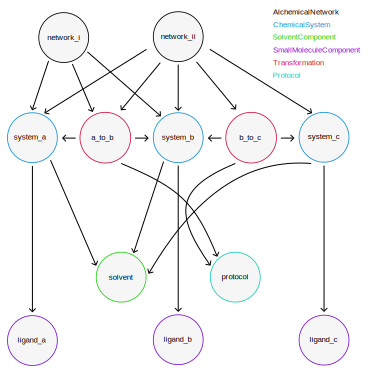

Understanding ``GufeTokenizables``\s
====================================

Most objects in **gufe** are subclasses of :class:`.GufeTokenizable`.
This base class enforces common behavior and sets requirements necessary to guarantee performance and reproducibility between all downstream packages that use **gufe**.

For example, when we create a ``SmallMoleculeComponent`` representing benzene, that object is also a ``GufeTokenizable``:

.. code-block:: python

    # load benzene as a gufe SmallMoleculeComponent
    >>> import gufe
    >>> benzene = gufe.SmallMoleculeComponent.from_sdf_file("benzene.sdf")
    >>> type(benzene)
    gufe.components.smallmoleculecomponent.SmallMoleculeComponent

    >>> from gufe.tokenization import GufeTokenizable
    >>> isinstance(benzene, GufeTokenizable)
    True

By definition, a ``GufeTokenizable`` must be:

1. :ref:`immutable <immutability>`
2. :ref:`hashable <gufe_keys>`
3. :ref:`serializable <serialization>`

.. _immutability:

1. Immutability of ``GufeTokenizable``\s
----------------------------------------

One important restriction on :class:`.GufeTokenizable` subclasses is that they must be immutable, meaning that its attributes do not change after initialization.
In other words, all attributes will be fixed when you create an object.
If your object is immutable, then it is suitable to be a ``GufeTokenizable``.

For example, once the benzene molecule from above is loaded, its attributes (such as ``name``) are immutable:

.. code-block:: python

    # benzene is a GufeTokenizable, and therefore immutable:
    >>> benzene.name
    'benzene'
    >>> benzene.name = 'benzene_1'
    AttributeError

While we cannot mutate ``benzene`` itself, we can create a new object based on a mutated copy of its contents.
Every ``GufeTokenizable`` has the :meth:`~.GufeTokenizable.copy_with_replacements` method, which is a convenience method around the following approach:

.. code-block:: python

    # get the contents of benzene as a dict
    >>> dct = benzene.to_dict()

    # now we can mutate any property in this dict
    >>> dct['molprops']['ofe-name'] = 'benzene1'

    # create a new gufe object based on the mutated dict
    >>> benzene1 = gufe.SmallMoleculeComponent.from_dict(dct)
    >>> benzene1.name
    'benzene1'

Immutability is critical to **gufe**'s design, because it means that **gufe** can generate a deterministic unique identifier (the :class:`.GufeKey`) based on the ``GufeTokenizable``'s properties.

.. _gufe_keys:

2. Hashing ``GufeTokenizable``\s: the ``GufeKey``
-------------------------------------------------

Because **gufe** objects are immutable, each object has a unique identifier, which we call its :class:`.GufeKey`.
The ``GufeKey`` is a string, typically in the format ``{CLASS_NAME}-{HEXADECIMAL_LABEL}``.

For our benzene ``SmallMoleculeComponent``, the key is ``'SmallMoleculeComponent-ec3c7a92771f8872dab1a9fc4911c795'``:

.. code-block:: python

    # get the GufeKey of the benzene GufeTokenizable
    >>> benzene.key
    'SmallMoleculeComponent-ec3c7a92771f8872dab1a9fc4911c795'

For most objects, the hexadecimal label is generated based on the contents of the class -- in particular, it is based on contents of the ``_to_dict()`` dictionary, filtered to remove anything that matches the ``_defaults()`` dictionary.

For our benzene object, that means that its ``GufeKey`` is directly determined from all items in its ``to_dict()`` representation, except for ``:version:``, since that is a default parameter:

.. _benzene_to_dict:

.. code-block:: python

    # these defaults are not used to determine the GufeKey
    >>> benzene.defaults()
    {'name': '', ':version:': 1}

    # these contents except for `version` (a default) are used to determine the GufeKey
    >>> benzene.to_dict()
    {'atoms': [(6, 0, 0, True, 0, 0, {}, 3),
    (6, 0, 0, True, 0, 0, {}, 3),
    (6, 0, 0, True, 0, 0, {}, 3),
    (6, 0, 0, True, 0, 0, {}, 3),
    (6, 0, 0, True, 0, 0, {}, 3),
    (6, 0, 0, True, 0, 0, {}, 3),
    (1, 0, 0, False, 0, 0, {}, 1),
    (1, 0, 0, False, 0, 0, {}, 1),
    (1, 0, 0, False, 0, 0, {}, 1),
    (1, 0, 0, False, 0, 0, {}, 1),
    (1, 0, 0, False, 0, 0, {}, 1),
    (1, 0, 0, False, 0, 0, {}, 1)],
    'bonds': [(0, 1, 12, 0, {}),
    (0, 5, 12, 0, {}),
    (0, 6, 1, 0, {}),
    (1, 2, 12, 0, {}),
    (1, 7, 1, 0, {}),
    (2, 3, 12, 0, {}),
    (2, 8, 1, 0, {}),
    (3, 4, 12, 0, {}),
    (3, 9, 1, 0, {}),
    (4, 5, 12, 0, {}),
    (4, 10, 1, 0, {}),
    (5, 11, 1, 0, {})],
    'conformer': ("\x93NUMPY\x01\x00v\x00{'descr': '<f8', 'fortran_order': False, 'shape': (12, 3), }                                                         \nî|?5^ú9@\x02+\x87\x16ÙN\x15@\x04V\x0e-²\x1d\x13@\x85ëQ¸\x1ee:@²\x9dï§ÆK\x14@Ë¡E¶óý\x0b@×£p=\nW;@q=\n×£p\x17@\x9eï§ÆK7\x07@\x83ÀÊ¡EÖ;@Év¾\x9f\x1a¯\x1b@Zd;ßO\x8d\x0c@ìQ¸\x1e\x85k;@b\x10X9´È\x1c@\x06\x81\x95C\x8bl\x13@sh\x91í|\x7f:@j¼t\x93\x18\x84\x19@ÇK7\x89Aà\x15@í\x9e<,Ô:9@<NÑ\x91\\¾\x12@\x97ÿ\x90~ûú\x14@\x0f\x9c3¢´÷9@\x8d(í\r¾ð\x10@ð\x16HPü\x98\x07@ªñÒMb°;@¼\x05\x12\x14?\x86\x16@Ãdª`TRþ?¦\x9bÄ °\x92<@Ý$\x06\x81\x95C\x1e@Kê\x044\x11¶\x08@RI\x9d\x80&Ò;@\x02\x9a\x08\x1b\x9e\x1e @zÇ):\x92\x8b\x15@9EGrù/:@}?5^ºI\x1a@]mÅþ²û\x19@",
    {}),
    'molprops': {'ofe-name': 'benzene'},
    '__qualname__': 'SmallMoleculeComponent',
    '__module__': 'gufe.components.smallmoleculecomponent',
    ':version:': 1}

This gives the ``GufeKey`` the following important properties:

* A ``GufeKey`` is based on a **cryptographic hash**, so it is extremely unlikely that two objects that are functionally different will have the same key.
* ``GufeKey`` creation is **deterministic**, so that it is preserved for a given Python environment across processes on the same hardware.

These properties, in particular the stability across Python sessions, make the ``GufeKey`` a stable identifier for the object.
This stability means that they can be used for store-by-reference, and therefore deduplicated to optimize memory and performance.

.. note::
    ``GufeKey``\s are not guaranteed to be stable across different Python environments or hardware.

Deduplication of ``GufeTokenizable``\s
^^^^^^^^^^^^^^^^^^^^^^^^^^^^^^^^^^^^^^

There are two types of deduplication of ``GufeTokenizable``\s:
* Objects are deduplicated in memory because **gufe** keeps a registry of all instantiated ``GufeTokenizable``\s.
* Objects can be deduplicated on storage to disk because we store by reference to the **gufe** key.

.. _gufe-memory-deduplication:

Deduplication in memory (flyweight pattern)
~~~~~~~~~~~~~~~~~~~~~~~~~~~~~~~~~~~~~~~~~~~

Memory deduplication means that only one object with a given ``GufeKey`` will exist in any single Python session.
We ensure this by maintaining a registry of all ``GufeTokenizable``\s that gets updated any time a ``GufeTokenizable`` is created.
The registry is a mapping to weak references, which allows Python's garbage collection to clean up ``GufeTokenizable``\s that are no longer needed.
This is essentially an implementation of the `flyweight pattern <https://en.wikipedia.org/wiki/Flyweight_pattern>`_.

This memory deduplication is ensured by the ``GufeTokenizable.from_dict``, which is typically used in deserialization.
It will always use the first object in memory with that ``GufeKey``.
This can lead to some unexpected behavior; for example, using the ``Foo`` class defined above:

.. code-block:: python

    # here Foo is a GufeTokenizable:
    >>> a = Foo(0)
    >>> b = Foo(0)
    >>> a is b
    False
    >>> c = Foo.from_dict(a.to_dict())
    >>> c is a  # surprise!
    True
    >>> d = Foo.from_dict(b.to_dict())
    >>> d is b
    False
    >>> d is a  # this is because `a` has the spot in the registry
    True

Deduplication on disk
~~~~~~~~~~~~~~~~~~~~~

Deduplication on disk storage is fundamentally the responsibility of the specific storage system, which falls outside the scope of **gufe**.
However, **gufe** provides some tools to facilitate implementation of a storage system.

The main idea is to use the ``GufeKey`` to ensure uniqueness, and to use it as a label for the object's serialized representation.
Additionally, the ``GufeKey``, which is simply a string, can be used as a stand-in for the object.
When an outer ``GufeTokenizable`` contains an inner ``GufeTokenizable``, the outer can store the ``GufeKey`` in place of the inner object.
That is, we can store by reference to the ``GufeKey``.

To convert a ``GufeTokenizable`` ``obj`` into a dictionary that references inner ``GufeTokenizable``\s by ``GufeKey``, use ``obj.to_keyed_dict()``.
That method replaces each ``GufeTokenizable`` by a ``dict`` with a single key, ``':gufe-key:'``, mapping to the ``GufeKey`` of the object.
Of course, you'll also need to do the same for all inner ``GufeTokenizables``; to get a list of all of them, use :func:`.get_all_gufe_objs` on the outermost ``obj``.

.. TODO: add a tutorial for this in the tutorials section?

.. _serialization:

3. Serializable Representations of ``GufeTokenizable``\s
--------------------------------------------------------

``GufeTokenizable``\s are also designed to be easily serializable, allowing them to be reliably passed between processes on the same or different machines, written to disk, stored in databases, etc. There are multiple *serialization* methods available, and a variety of *representations* ``GufeTokenizable``\s can take on, to meet different use cases.

Representations
^^^^^^^^^^^^^^^

Each subclass's implementation of ``to_dict()`` defines what information a ``GufeTokenizable`` will serialize, and all other representations (``to_shallow_dict``, ``to_keyed_dict``, ``to_keyed_chain``) behavior are determined by this basic ``to_dict()`` definition.

a) dictionary
~~~~~~~~~~~~~

The ``to_dict()`` method is the most explicit way to represent a ``GufeTokenizable``.
This method recursively unpacks any inner ``GufeTokenizable``\s that an outer ``GufeTokenizable`` contains to their full ``dict`` representation.
Although this method is best way to see all information stored in a ``GufeTokenizable``, it is also the least space-efficient.

For example, we can easily comprehend the ``to_dict()`` representation of benzene :ref:`as shown above <benzene_to_dict>`, but for a larger and deeply nested object, such as an ``AlchemicalNetwork``, the ``to_dict()`` representation is neither easily readable by humans or memory-efficient.
``GufeTokenizable``\s referenced multiple times among the nested objects are duplicated in this representation.

.. TODO: show this method
.. TODO: diagram

b) shallow dictionary
~~~~~~~~~~~~~~~~~~~~~

The ``to_shallow_dict()`` method is similar to ``to_dict()`` in that it unpacks a tokenizable into a ``dict`` format, but a shallow dict is *not recursive* and only unpacks the top level of the ``GufeTokenizable``.
Any nested ``GufeTokenizable``\s are left as-is.

.. code-block:: python

    # shallow dict representation of an alchemical network
    >>> alchemical_network.to_shallow_dict()
    {
    'nodes': [
        ChemicalSystem(name=benzene-solvent, components={'ligand': SmallMoleculeComponent(name=benzene), 'solvent': SolventComponent(name=O, K+, Cl-)}),
        ChemicalSystem(name=toluene-solvent, components={'ligand': SmallMoleculeComponent(name=toluene), 'solvent': SolventComponent(name=O, K+, Cl-)}),
        ChemicalSystem(name=styrene-solvent, components={'ligand': SmallMoleculeComponent(name=styrene), 'solvent': SolventComponent(name=O, K+, Cl-)}),
        ChemicalSystem(name=phenol-solvent, components={'ligand': SmallMoleculeComponent(name=phenol), 'solvent': SolventComponent(name=O, K+, Cl-)})
        ],
    'edges': [
        Transformation(stateA=ChemicalSystem(name=benzene-solvent, components={'ligand': SmallMoleculeComponent(name=benzene), 'solvent': SolventComponent(name=O, K+, Cl-)}), stateB=ChemicalSystem(name=toluene-solvent, components={'ligand': SmallMoleculeComponent(name=toluene), 'solvent': SolventComponent(name=O, K+, Cl-)}), protocol=<Protocol-d01baed9cf2500c393bd6ddb35ee38aa>, name=None),
        Transformation(stateA=ChemicalSystem(name=benzene-solvent, components={'ligand': SmallMoleculeComponent(name=benzene), 'solvent': SolventComponent(name=O, K+, Cl-)}), stateB=ChemicalSystem(name=styrene-solvent, components={'ligand': SmallMoleculeComponent(name=styrene), 'solvent': SolventComponent(name=O, K+, Cl-)}), protocol=<Protocol-d01baed9cf2500c393bd6ddb35ee38aa>, name=None),
        Transformation(stateA=ChemicalSystem(name=benzene-solvent, components={'ligand': SmallMoleculeComponent(name=benzene), 'solvent': SolventComponent(name=O, K+, Cl-)}), stateB=ChemicalSystem(name=phenol-solvent, components={'ligand': SmallMoleculeComponent(name=phenol), 'solvent': SolventComponent(name=O, K+, Cl-)}), protocol=<Protocol-d01baed9cf2500c393bd6ddb35ee38aa>, name=None)
        ],
    'name': None,
    '__qualname__': 'AlchemicalNetwork',
    '__module__': 'gufe.network',
    ':version:': 1
    }

.. TODO: diagram

This representation is most useful for iterating through the hierarchy of a ``GufeTokenizable`` one layer at a time.
Because it leaves nested ``GufeTokenizable``\s untouched, it is generally unsuitable for serialization.

c) keyed dictionary
~~~~~~~~~~~~~~~~~~~

The ``to_keyed_dict()`` method is similar to ``to_shallow_dict`` in that it only unpacks the first layer of a ``GufeTokenizable``.
However, a keyed dict represents the next layer as its ``GufeKey``, e.g. ``{':gufe-key:': 'ChemicalSystem-96f686efdc070e01b74888cbb830f720'}``.

A keyed dict is the most compact representation of a ``GufeTokenizable`` and can be useful for understanding its contents, but it does not have the complete representation for reconstruction or sending information (for this, see the next section, :ref:`keyed chain <keyed_chain>`)

.. code-block:: python

    # keyed dict representation of an alchemical network
    >>> alchemical_network.to_keyed_dict()
    {
    'nodes': [
        {':gufe-key:': 'ChemicalSystem-3c648332ff8dccc03a1e1a3d44bc9755'},
        {':gufe-key:': 'ChemicalSystem-655f4d0008a537fe811b11a2dc4a029e'},
        {':gufe-key:': 'ChemicalSystem-6a13159b10c95cb05f542de64ec91fe7'},
        {':gufe-key:': 'ChemicalSystem-ba83a53f18700b3738680da051ff35f3'}
        ],
    'edges': [
        {':gufe-key:': 'Transformation-4d0f802817071c8d14b37efd35187318'},
        {':gufe-key:': 'Transformation-7e7433a86239a41490da52222bf6f78f'},
        {':gufe-key:': 'Transformation-e8d1ccf53116e210d1ccbc3870007271'}
        ],
    'name': None,
    '__qualname__': 'AlchemicalNetwork',
    '__module__': 'gufe.network',
    ':version:': 1
    }

.. TODO: diagram

.. _keyed_chain:

d) keyed chain
~~~~~~~~~~~~~~

The ``to_keyed_chain()`` method is a powerful representation of a ``GufeTokenizable`` that enables efficient reconstruction of an object without duplication.
It uses ``to_keyed_dict()`` to unpack a ``GufeTokenizable`` from the bottom (innermost) layer up into a flat list of tuples, in the form ``[(gufe_key, keyed_dict)]``.
The length of this list is equal to the number of unique ``GufeTokenizables`` required to represent the object.
This bottom-up deduplication strategy effectively constructs a DAG (`directed acyclic graph <https://en.wikipedia.org/wiki/Directed_acyclic_graph>`_) where re-used ``GufeTokenizable``\s are deduplicated.

To show the structure of a keyed chain, below we have redacted all information except the ``GufeKey``\s from the output:

.. code-block:: python

    # keyed chain representation ('...' indicates hidden output)
    >>> alchemical_network.to_keyed_chain()
    [
    ('SolventComponent-e0e47f56b43717156128ad4ae2d49897',{...}),
    ('SmallMoleculeComponent-3b51f5f92521c712049da092ab061930', {...}),
    ('SmallMoleculeComponent-ec3c7a92771f8872dab1a9fc4911c795', {...}),
    ('SmallMoleculeComponent-8225dfb11f2e8157a3fcdcd673d3d40e', {...}),
    ('Protocol-d01baed9cf2500c393bd6ddb35ee38aa', {...}),
    ('ChemicalSystem-ba83a53f18700b3738680da051ff35f3', {
        'components': {
            'ligand': {':gufe-key:': 'SmallMoleculeComponent-3b51f5f92521c712049da092ab061930'},
            'solvent': {':gufe-key:': 'SolventComponent-e0e47f56b43717156128ad4ae2d49897'}
            },
        ...}),
    ('ChemicalSystem-3c648332ff8dccc03a1e1a3d44bc9755', {
        'components': {
            'ligand': {':gufe-key:': 'SmallMoleculeComponent-ec3c7a92771f8872dab1a9fc4911c795'},
            'solvent': {':gufe-key:': 'SolventComponent-e0e47f56b43717156128ad4ae2d49897'},
            },
        ...}),
    ('ChemicalSystem-655f4d0008a537fe811b11a2dc4a029e', {
        'components': {
            'ligand': {':gufe-key:': 'SmallMoleculeComponent-8225dfb11f2e8157a3fcdcd673d3d40e'},
            'solvent': {':gufe-key:': 'SolventComponent-e0e47f56b43717156128ad4ae2d49897'}
            },
        ...}),
    ('Transformation-e8d1ccf53116e210d1ccbc3870007271', {
        'stateA': {':gufe-key:': 'ChemicalSystem-3c648332ff8dccc03a1e1a3d44bc9755'},
        'stateB': {':gufe-key:': 'ChemicalSystem-ba83a53f18700b3738680da051ff35f3'},
        'protocol': {':gufe-key:': 'DummyProtocol-d01baed9cf2500c393bd6ddb35ee38aa'},
        ...}),
    ('Transformation-4d0f802817071c8d14b37efd35187318', {
        'stateA': {':gufe-key:': 'ChemicalSystem-3c648332ff8dccc03a1e1a3d44bc9755'},
        'stateB': {':gufe-key:': 'ChemicalSystem-655f4d0008a537fe811b11a2dc4a029e'},
        'protocol': {':gufe-key:': 'DummyProtocol-d01baed9cf2500c393bd6ddb35ee38aa'},
        ...}),
    ('AlchemicalNetwork-f8bfd63bc848672aa52b081b4d68fadf', {
        'nodes': [
            {':gufe-key:': 'ChemicalSystem-3c648332ff8dccc03a1e1a3d44bc9755'},
            {':gufe-key:': 'ChemicalSystem-655f4d0008a537fe811b11a2dc4a029e'},
            {':gufe-key:': 'ChemicalSystem-ba83a53f18700b3738680da051ff35f3'}
            ],
        'edges': [
            {':gufe-key:': 'Transformation-4d0f802817071c8d14b37efd35187318'},
            {':gufe-key:': 'Transformation-e8d1ccf53116e210d1ccbc3870007271'},
            ],
        ...}),
    ]

For keyed chains, the order of the elements in this list matters!
When deserializing the keyed chain back into a ``GufeTokenizable``, this list is iterated through in order, meaning that each object can only reference ``GufeKey``\s that come *before* it in this list.

Below is a diagram of how a nested ``GufeTokenizable`` (in this case an ``AlchemicalNetwork``) can be represented as a keyed chain, with the first elements in the keyed chain at the bottom of the graph.
Note that this graphical representation is a Directed Acyclic Graph (DAG):

Serialization Methods
^^^^^^^^^^^^^^^^^^^^^

All ``GufeTokenizables`` can be serialized as either JSON (``to_json()``) or `MessagePack <https://msgpack.org/index.html>`_ (``to_msgpack()``).
JSON is preferable for human-readability, archival, and interoperability with other tools that do not use **gufe**.
MessagePack is a more efficient format and ideal for passing information between processes, but it is not human-readable and requires **gufe** for extracting any data.

.. note::
    See :doc:`../how-tos/serialization` for details on how to implement serialization of your own GufeTokenizables.
