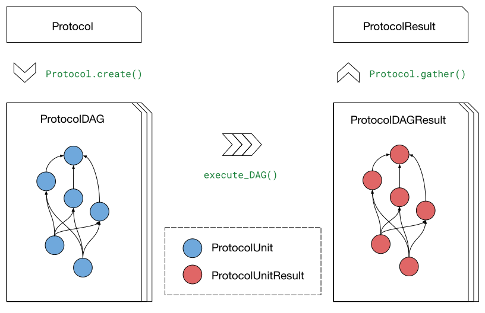

.. _howto-protocol:

How to define a new ``Protocol``
================================

The **gufe** :ref:`Protocols <protocol>` system is designed as an *extensible point* of the library,
allowing developers to write their own methods for performing free energy calculations in a form that can take full advantage of the OpenFE ecosystem.

Our recommendation in this how-to is to start simple;
we will call out areas where you can iterate further on making your ``Protocol`` more sophisticated.

Overview: What makes a ``Protocol``
-----------------------------------

A complete ``Protocol`` implementation requires the following interconnected components:

1. **Settings class**: A `Pydantic <https://docs.pydantic.dev/latest/>`_ model defining configuration parameters
2. **Protocol class**: The main class that creates computational workflows
3. **ProtocolUnit classes**: Individual computational steps in the workflow
4. **ProtocolResult class**: Container for aggregated results from multiple runs

The ``Protocol`` creates a :ref:`ProtocolDAG <protocoldag>` (directed acyclic graph) of :ref:`ProtocolUnit <protocolunit>` objects that define the computational workflow.
Multiple ``ProtocolDAG`` executions can be aggregated into a single :ref:`ProtocolResult <protocolresult>` to provide statistical estimates.

Step 1: Define your Settings
-----------------------------

First, create a settings class that inherits from :class:`.Settings`.
This defines all the configuration parameters your protocol needs:

.. code-block:: python

    from gufe.settings import Settings
    import pydantic
    from openff.units import unit

    class MyProtocolSettings(Settings):
        # Required: number of independent simulations
        n_repeats: int = 5
        
        # Protocol-specific parameters
        simulation_length: pydantic.Field(
            default=10.0 * unit.nanosecond,
            description="Length of each simulation"
        )
        
        equilibration_length: pydantic.Field(
            default=1.0 * unit.nanosecond, 
            description="Equilibration time before production"
        )

Step 2: Define your ProtocolResult
----------------------------------

Create a result class that inherits from :ref:`ProtocolResult <protocolresult>`and defines how to compute estimates and uncertainties from your protocol's outputs:

.. code-block:: python

    from gufe import ProtocolResult
    from openff.units import unit
    import numpy as np

    class MyProtocolResult(ProtocolResult):
        
        def get_estimate(self) -> unit.Quantity:
            """Calculate the free energy estimate from all runs."""
            # Extract the key results from all completed runs
            free_energies = []
            for run_result in self.data["free_energies"]:
                free_energies.append(run_result)
            
            # Return the mean as our best estimate
            mean_dg = np.mean(free_energies) * unit.kilocalorie_per_mole
            return mean_dg
        
        def get_uncertainty(self) -> unit.Quantity:
            """Calculate the uncertainty from all runs."""
            free_energies = self.data["free_energies"]
            if len(free_energies) < 2:
                return 0.0 * unit.kilocalorie_per_mole
            
            std_err = np.std(free_energies) / np.sqrt(len(free_energies))
            return std_err * unit.kilocalorie_per_mole

Step 3: Define your ProtocolUnits
----------------------------------

Create the computational units that will perform the actual work.
Each unit should inherit from :ref:`ProtocolUnit <protocolunit>` and implement an ``_execute`` method.

.. important :: 

   Use ``ctx.shared`` for large objects that need to be passed between units.
   This avoids serialization issues and improves performance by keeping file paths in the return objects instead of the large objects themselves.

.. code-block:: python

    from gufe import ProtocolUnit

    class SetupUnit(ProtocolUnit):
        """Prepare the system for simulation."""
        
        @staticmethod
        def _execute(ctx, *, stateA, stateB, mapping, settings, **inputs):
            """Set up the alchemical system."""
            import pickle
            from pathlib import Path
            
            # ctx provides scratch and shared directories
            # Use ctx.shared to write files that other units will need
            shared_dir = Path(ctx.shared)
            
            # Your setup logic here...
            # - Create alchemical system from stateA/stateB
            # - Apply the atom mapping 
            # - Set up force field parameters
            prepared_system = ...  # Your setup code here
            topology = ...         # Your topology creation
            coordinates = ...      # Your coordinate preparation
            
            # Write large objects to shared directory instead of returning them
            system_file = shared_dir / "system.pkl"
            topology_file = shared_dir / "topology.pkl" 
            coords_file = shared_dir / "initial_coords.pkl"
            
            with open(system_file, 'wb') as f:
                pickle.dump(prepared_system, f)
            with open(topology_file, 'wb') as f:
                pickle.dump(topology, f)
            with open(coords_file, 'wb') as f:
                pickle.dump(coordinates, f)
            
            return {
                "system_file": str(system_file),
                "topology_file": str(topology_file),
                "initial_coordinates_file": str(coords_file),
                "log": "System setup completed"
            }

    class SimulationUnit(ProtocolUnit):
        """Run an individual simulation."""
        
        @staticmethod 
        def _execute(ctx, *, setup_result, window, settings, **inputs):
            """Execute a single alchemical window simulation."""
            import pickle
            from pathlib import Path
            
            # Load large objects from files written by setup unit
            with open(setup_result.outputs["system_file"], 'rb') as f:
                system = pickle.load(f)
            with open(setup_result.outputs["topology_file"], 'rb') as f:
                topology = pickle.load(f)
            with open(setup_result.outputs["initial_coordinates_file"], 'rb') as f:
                coordinates = pickle.load(f)
            
            # Your simulation logic here...
            # - Run equilibration
            # - Run production simulation
            # - Calculate free energy contribution
            dg_contribution = ...  # Your free energy calculation
            final_coords = ...     # Your final coordinates
            
            # Write output files to shared directory
            shared_dir = Path(ctx.shared)
            final_coords_file = shared_dir / f"final_coords_window_{window}.pkl"
            
            with open(final_coords_file, 'wb') as f:
                pickle.dump(final_coords, f)
            
            return {
                "free_energy_contribution": dg_contribution,
                "final_coordinates_file": str(final_coords_file),
                "window": window,
                "log": f"Simulation completed for window {window}"
            }

    class AnalysisUnit(ProtocolUnit):
        """Analyze results from all simulations."""
        
        @staticmethod
        def _execute(ctx, *, simulation_results, settings, **inputs):
            """Combine results from all simulation windows."""
            import pickle
            from pathlib import Path
            
            # simulation_results will be a list of ProtocolUnitResult objects
            total_free_energy = 0.0
            logs = []
            final_coords = {}
            
            for sim_result in simulation_results:
                # Extract numerical results directly
                total_free_energy += sim_result.outputs["free_energy_contribution"]
                logs.append(sim_result.outputs["log"])
                
                # Load coordinate files if needed for analysis
                window = sim_result.outputs["window"]
                coords_file = sim_result.outputs["final_coordinates_file"]
                with open(coords_file, 'rb') as f:
                    coords = pickle.load(f)
                final_coords[window] = coords
            
            # Write final analysis results to shared directory
            shared_dir = Path(ctx.shared)
            analysis_file = shared_dir / "final_analysis.pkl"
            
            analysis_data = {
                "total_free_energy": total_free_energy,
                "final_coordinates": final_coords,
                "simulation_logs": logs
            }
            
            with open(analysis_file, 'wb') as f:
                pickle.dump(analysis_data, f)
            
            return {
                "total_free_energy": total_free_energy,
                "analysis_file": str(analysis_file),
                "log": "Analysis completed"
            }

Step 4: Implement your Protocol class
-------------------------------------

Now create your main custom ``Protocol`` class that inherits from :ref:`Protocol <protocol>` and ties everything together:

.. code-block:: python

    from gufe import Protocol, ChemicalSystem, ComponentMapping, ProtocolDAGResult, ProtocolUnit
    from typing import Optional, Union, List, Iterable, Any

    class MyProtocol(Protocol):
        # Required class attributes
        result_cls = MyProtocolResult
        _settings_cls = MyProtocolSettings
        
        @classmethod
        def _default_settings(cls) -> MyProtocolSettings:
            """Provide sensible default settings."""
            return MyProtocolSettings(
                # Include any thermodynamic settings your protocol needs
                # thermo_settings=ThermoSettings(temperature=298.15 * unit.kelvin),
                # Protocol-specific defaults
                n_repeats=5,
                simulation_length=10.0 * unit.nanosecond,
                equilibration_length=1.0 * unit.nanosecond
            )
        
        def _create(
            self,
            stateA: ChemicalSystem,
            stateB: ChemicalSystem,
            mapping: Optional[Union[ComponentMapping, List[ComponentMapping]]] = None,
            extends: Optional[ProtocolDAGResult] = None,
        ) -> List[ProtocolUnit]:
            """Create the computational workflow."""
            
            # Handle extension from previous results if needed
            if extends is not None:
                # Extract useful information from the previous run
                # This might be final coordinates, equilibrated structures, etc.
                starting_point = extends.protocol_unit_results[-1].outputs
            else:
                starting_point = None
            
            # Create the setup unit (runs once)
            setup = SetupUnit(
                name="system_setup",
                stateA=stateA,
                stateB=stateB,
                mapping=mapping,
                settings=self.settings,
                starting_point=starting_point
            )
            
            # Create multiple independent simulation units
            simulations = []
            for i in range(self.settings.n_repeats):
                sim_unit = SimulationUnit(
                    name=f"simulation_{i}",
                    setup_result=setup,  # This creates the dependency
                    window=i,
                    settings=self.settings
                )
                simulations.append(sim_unit)
            
            # Create analysis unit that depends on all simulations
            analysis = AnalysisUnit(
                name="final_analysis",
                simulation_results=simulations,  # Depends on all simulations
                settings=self.settings
            )
            
            # Return all units - dependencies are implicit from constructor args
            return [setup, *simulations, analysis]
        
        def _gather(self, protocol_dag_results: Iterable[ProtocolDAGResult]) -> dict[str, Any]:
            """Aggregate results from multiple ProtocolDAG executions."""
            # This method combines results from multiple independent protocol runs
            # into data that the ProtocolResult can use to compute estimates
            
            free_energies = []
            all_logs = []
            
            for dag_result in protocol_dag_results:
                # Find the terminal (final) unit results
                for unit_result in dag_result.terminal_protocol_unit_results:
                    if unit_result.name == "final_analysis":
                        free_energies.append(
                            unit_result.outputs["total_free_energy"]
                        )
                        all_logs.extend(unit_result.outputs["simulation_logs"])
            
            return {
                "free_energies": free_energies,
                "logs": all_logs
            }

Step 5: Add validation (optional)
----------------------------------

You can add custom validation to check that inputs are compatible with your protocol:

.. code-block:: python

    class MyProtocol(Protocol):
        # ... other methods ...
        
        def _validate(
            self, 
            *, 
            stateA: ChemicalSystem, 
            stateB: ChemicalSystem, 
            mapping: Optional[Union[ComponentMapping, List[ComponentMapping]]] = None,
            extends: Optional[ProtocolDAGResult] = None
        ):
            """Validate inputs for this protocol."""
            from gufe.protocols.errors import ProtocolValidationError
            
            # Check that both states have the required components
            if not stateA.components or not stateB.components:
                raise ProtocolValidationError("Empty chemical systems not supported")
            
            # Check that we have a mapping if needed
            if mapping is None:
                raise ProtocolValidationError("This protocol requires atom mappings")
            
            # Check ability to extend from given results
            if extends and not extends.ok():
                raise ProtocolValidationError("Cannot extend from failed ProtocolDAGResult")

Understanding ProtocolUnit dependencies
---------------------------------------

Dependencies between ``ProtocolUnit`` objects are established implicitly by passing one unit as a constructor argument to another:

.. code-block:: python

    # setup runs first (no dependencies)
    setup = SetupUnit(name="setup", ...)
    
    # simulation depends on setup (setup passed as argument)
    simulation = SimulationUnit(name="sim", setup_result=setup, ...)
    
    # analysis depends on simulation (simulation passed as argument)
    analysis = AnalysisUnit(name="analysis", simulation_results=[simulation], ...)

``ProtocolUnit`` objects can also be nested in dictionaries and lists, and dependencies will still be detected:

.. code-block:: python

    # Dependencies work when units are in lists
    simulations = [sim1, sim2, sim3]
    analysis = AnalysisUnit(name="analysis", simulations=simulations, ...)
    
    # Dependencies work when units are in dictionaries  
    unit_dict = {"equilibration": eq_unit, "production": prod_unit}
    final_unit = FinalUnit(name="final", inputs=unit_dict, ...)

The ``ProtocolDAG`` automatically determines the execution order from these dependencies.
Units with no dependencies run first, followed by units whose dependencies have completed.

Putting it all together: A complete example
--------------------------------------------

Here's a simplified but complete protocol implementation:

.. code-block:: python

    from gufe import Protocol, ProtocolUnit, ProtocolResult
    from gufe.settings import Settings
    from openff.units import unit
    from typing import Iterable, Any, List
    import numpy as np

    # Settings
    class SimpleProtocolSettings(Settings):
        n_repeats: int = 3

    # Result
    class SimpleProtocolResult(ProtocolResult):
        def get_estimate(self):
            return np.mean(self.data["values"]) * unit.kilocalorie_per_mole
        
        def get_uncertainty(self):
            values = self.data["values"]
            if len(values) < 2:
                return 0.0 * unit.kilocalorie_per_mole
            return np.std(values) / np.sqrt(len(values)) * unit.kilocalorie_per_mole

    # Units
    class SimpleUnit(ProtocolUnit):
        @staticmethod
        def _execute(ctx, **inputs):
            # Simulate a calculation that returns a random result
            result = np.random.normal(5.0, 1.0)  # Mean=5, std=1
            return {"result": result}

    # Protocol
    class SimpleProtocol(Protocol):
        result_cls = SimpleProtocolResult
        _settings_cls = SimpleProtocolSettings
        
        @classmethod
        def _default_settings(cls):
            return SimpleProtocolSettings(n_repeats=3)
        
        def _create(self, stateA, stateB, mapping=None, extends=None) -> List[ProtocolUnit]:
            # Create n_repeats independent units
            units = [
                SimpleUnit(name=f"calc_{i}", replica=i, settings=self.settings)
                for i in range(self.settings.n_repeats)
            ]
            return units
        
        def _gather(self, protocol_dag_results: Iterable[ProtocolDAGResult]) -> dict[str, Any]:
            values = []
            for dag_result in protocol_dag_results:
                for unit_result in dag_result.protocol_unit_results:
                    values.append(unit_result.outputs["result"])
            return {"values": values}

Using your Protocol
-------------------

Once implemented, your protocol can be used like any other **gufe** protocol:

.. code-block:: python

    # Create protocol with custom settings
    settings = MyProtocolSettings(n_repeats=10, simulation_length=20*unit.nanosecond)
    protocol = MyProtocol(settings)
    
    # Create a ProtocolDAG for specific chemical systems
    dag = protocol.create(
        stateA=chem_system_a,
        stateB=chem_system_b,
        mapping=atom_mapping
    )
    
    # Execute on a scheduler (not shown)
    # dag_result = scheduler.execute(dag)
    
    # Gather multiple results into final estimate
    # final_result = protocol.gather([dag_result1, dag_result2, ...])

Best practices and tips
-----------------------

1. **Start simple**: Begin with a minimal working implementation and add complexity gradually.

2. **Handle errors gracefully**: Use ``try``/``except`` in ``_execute`` methods and return meaningful error information.

3. **Use the context effectively**: The ``ctx`` parameter provides ``scratch`` (temporary, persists over execution of a single ``ProtocolUnit``) and ``shared`` (persists over execution of the ``ProtocolDAG``) directories.
   Use ``ctx.shared`` for large objects that need to pass between units; store file paths in return objects, not the objects themselves.

4. **Test thoroughly**: Write unit tests for your ``ProtocolUnit`` classes early in development.

5. **Document your settings**: Use Pydantic's `Field() function <https://docs.pydantic.dev/latest/concepts/fields/>`_ with descriptions to document what each setting does.

6. **Consider serialization**: All your classes should be serializable - avoid complex objects that can't be serialized with ``GufeTokenizable.to_json``.

7. **Resource management**: Clean up temporary files in your ``_execute`` methods when possible.

8. **Validate early**: Implement ``_validate`` to catch configuration problems before expensive computations begin.

Testing your Protocol
----------------------

Create unit tests for each component:

.. code-block:: python

    def test_protocol_creation():
        """Test that the protocol can be created with default settings."""
        protocol = MyProtocol(MyProtocol.default_settings())
        assert isinstance(protocol.settings, MyProtocolSettings)

    def test_dag_creation(sample_chemical_systems):
        """Test ProtocolDAG creation."""
        protocol = MyProtocol(MyProtocol.default_settings())
        dag = protocol.create(
            stateA=sample_chemical_systems[0],
            stateB=sample_chemical_systems[1],
            mapping=sample_mapping
        )
        
        assert len(dag.protocol_units) > 0
        # Test that dependencies are set up correctly
        
    def test_unit_execution():
        """Test individual ProtocolUnit execution."""
        from gufe.protocols.protocolunit import Context
        
        unit = SimpleUnit(name="test", replica=0, settings=SimpleProtocolSettings())
        
        # Mock context and inputs
        ctx = Context(scratch="/tmp", shared="/tmp")
        result = unit._execute(ctx, replica=0)
        
        assert "result" in result
        assert isinstance(result["result"], float)
